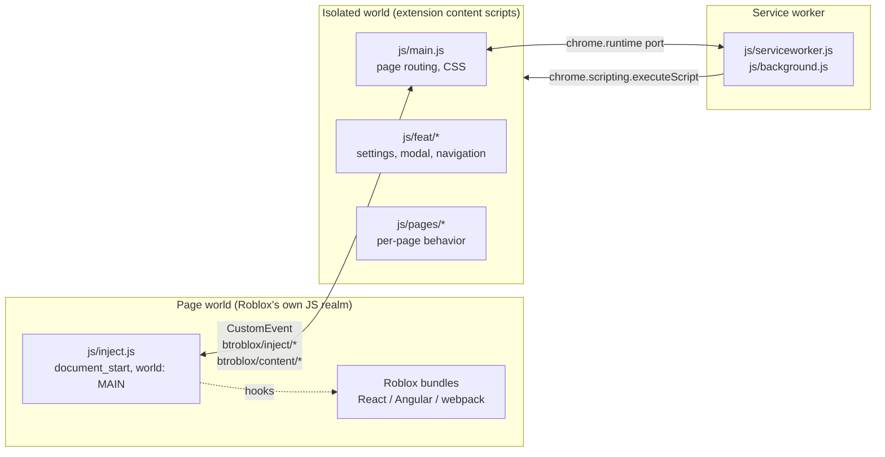

# Architecture

BETRoblox is a Chromium Manifest V3 extension that modifies the Roblox website
in the browser. There is no server, no database, no hosted service, and no
deployment pipeline. The only "environment" is a browser with the unpacked
extension loaded.

## Components

### Page world — `js/inject.js`

Runs at `document_start` in Roblox's own JavaScript realm (`world: "MAIN"`).
This is the only place that can reach Roblox's React internals, Angular modules,
and webpack chunks, because the isolated world cannot see them.

It **uses no `chrome.*` API at all**, which is what makes it testable outside a
browser: `test/helpers/page-world.js` loads it in a `node:vm` realm with a small
DOM stub.

Hooks are installed eagerly from the `EAGER_HOOKS` list, gated on a settings
snapshot cached in `localStorage["BTRoblox:pageSettings"]`. That cache exists
because Roblox can render a bundle before the isolated world has finished its
asynchronous settings load. The avatar limit hook requires the Avatar group and
its accessory-limit setting at that point; the layered-limit setting is read per
call. A consequence worth knowing: **whether a hook is installed is decided
once, at `document_start`**. Enabling a setting that was off when the page loaded
takes effect after a reload. Toggling a setting that was on when the page loaded
takes effect immediately, because each hook re-reads the setting per call.

### Isolated world — `js/main.js`, `js/feat/*`, `js/pages/*`

Holds `chrome.*`, owns settings, decides the current page from `PAGE_INFO`,
injects page CSS, and renders the settings modal. Talks to the page world only
through DOM `CustomEvent`s.

### Service worker — `js/serviceworker.js` → `js/background.js`

Owns `chrome.storage`, `declarativeNetRequest` rules, context menus, and
lazy feature injection via `chrome.scripting.executeScript`.

## Trust boundaries

| Boundary | Rule |
| --- | --- |
| Page world | **Untrusted.** Shares a realm with Roblox and any other page script. Never put secrets or privileged calls here. It has no `chrome.*` access by design. |
| Isolated world | Holds `chrome.*`. Receives page-world messages as **data**, never as instructions. |
| Service worker | Only component with storage and network-rule privileges. |
| Roblox session | Owned by the browser. The extension sends `credentials: "include"` and echoes the `X-CSRF-TOKEN` header Roblox returns. It never reads cookies, never stores tokens, and never handles credentials. |

No purchase path exists anywhere in the extension, and
`tools/validate-extension.js` fails the build if one appears.

## Data flow: a settings change

1. User toggles a checkbox in the settings modal (`js/feat/settingsmodal.js`).
2. `SETTINGS` persists to `chrome.storage` through the service worker.
3. The wildcard `SETTINGS.onChange` listener in `js/main.js` fires.
4. `injectScript.send("updateSettings", …)` dispatches
   `btroblox/inject/updateSettings` on `document`.
5. `js/inject.js` replaces `pageSettings` and rewrites the localStorage cache.
6. Installed hooks pick up the new value on their next call.

## Asset registries

Three separate places name files that must exist. Only the first is a manifest,
which is why `tools/validate-extension.js` checks all three.

| Registry | Location | Loaded by |
| --- | --- | --- |
| Content scripts, worker, icons | `manifest.chrome.json`, `manifest.firefox.json` | The browser |
| Page JS and CSS | `PAGE_INFO` in `js/main.js` | `insertCSS` / page loader at runtime |
| Lazy features | `optionalFeatures` in `js/feat/loadfeature.js` | `chrome.scripting.executeScript` |

Themes fan out in `updatePageCSS`: every stylesheet in the set is also requested
as `<theme>/<file>` for the non-default themes. `ducky.css` is appended *after*
the fan-out, so it is the one sheet with no theme variants.

## Build

Chromium wants `manifest.json`; this tree keeps one manifest per target.
`tools/build-manifest.js` validates, then copies the target manifest into place
and records provenance in a gitignored `.manifest-build.json`. Both generated
files are untracked. The build is idempotent and refuses to overwrite a
`manifest.json` it did not write without `--force`.

Validation is split deliberately:

- **Source checks** resolve paths against the repository. This is what CI runs.
- **Generated checks** (`--generated=DIR`) resolve paths against the directory a
  browser will load, and verify the manifest is byte-identical to its source.
  Only these can catch an incomplete copy, such as a staged extension missing
  `res/` — the source checks would pass, because `res/` exists in the repo.

## Avatar accessory limits

`injectedFunctions.removeAccessoryLimits` in `js/inject.js` is the most fragile
part of the extension and the one with dedicated tests.

Roblox keeps its avatar rules module private inside the avatar bundle, built
with `Object.defineProperty` getters. The hook intercepts `Object.defineProperty`
itself and rewrites the descriptor as the bundle defines it, wrapping four keys:

| Key | Treatment |
| --- | --- |
| `getAdvancedAccessoryLimit` | Returns `undefined` for supported asset types so no limit applies |
| `maxNumberOfLayeredClothingItems` | A plain number, so it is **recomputed on every read**; latching it would freeze the value for the life of the page |
| `getAssetTypeById` | Raises `maxNumber` **in place**, because Roblox compares rule entries by identity. The pre-raise value is recorded so a disable can restore it |
| `addAssetToAvatar` | Lets the original apply Roblox's category caps, then puts back what it dropped, up to `KEEP_LIMIT` |

Disabling either limit setting restores the affected raised entries eagerly,
for both the initial `btroblox/init` settings delivery and later
`updateSettings` events, rather than waiting for each entry to be looked up
again. Re-enabling is lazy on purpose: a stale reference reading the original
cap under-permits, which is the safe direction.

### `KEEP_LIMIT` is 100, and upstream's is 10

Upstream ReBTRoblox keeps 10 accessory and 10 layered items. BETRoblox keeps
`RAISED_LIMIT` (100) to match the contract in issue #2. **This divergence is
deliberate and not yet validated against the live avatar editor.** Whether the
editor stays responsive, whether the avatar composite renders correctly, and
whether save/equip behaves at those counts are authenticated-QA questions
tracked in `docs/QA_PHASE_ONE.md`. If live testing shows the editor degrades,
lowering `KEEP_LIMIT` is a one-constant change.

### What the tests cannot prove

`test/inject.accessory-limits.test.js` pins the hook contract: what the
interceptor does to a descriptor and what each replacement returns in each
settings state. It cannot prove that Roblox's live bundle still publishes these
keys through `defineProperty` getters. If Roblox changes that, the tests keep
passing while the hook silently does nothing. Only authenticated QA closes that
gap.
